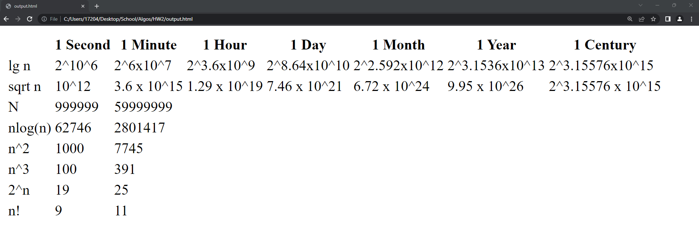
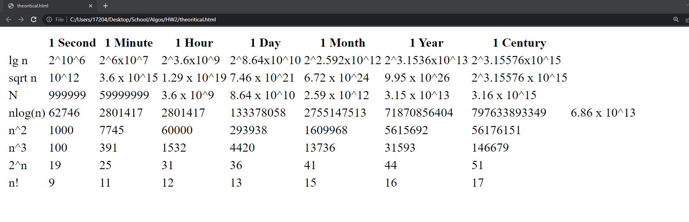
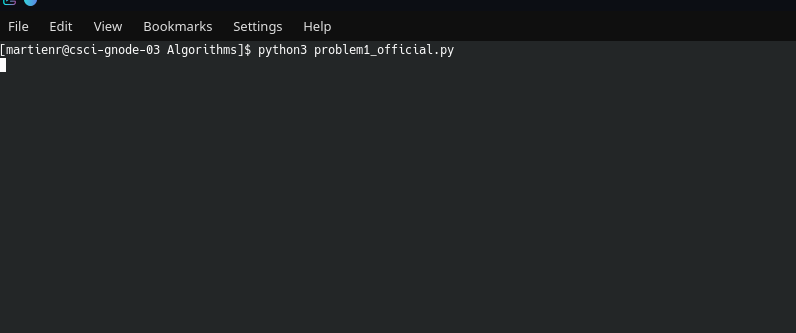
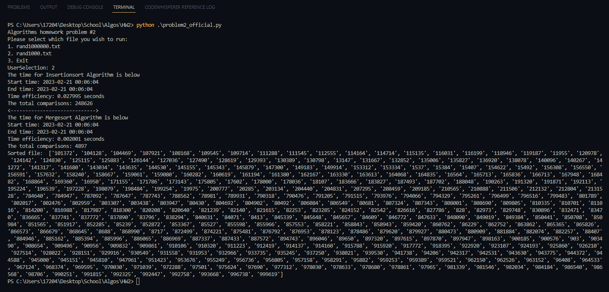
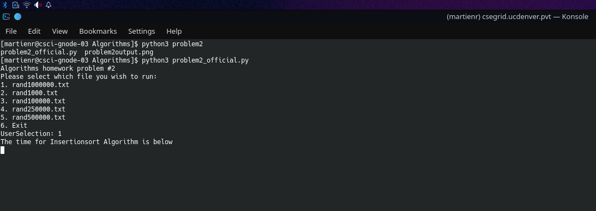

# HW2 Algorithms

* Name: Enrique Martinez-Acevedo
* Student ID: 106065825
* Class: CSCI 3412 002
* Due Date: February 20th 2023

# README

## Programs Description

* The following programs will analyze a series of Algorithmic tasks.
  * Comparison run times analyzing run times of different log functions
  * Comparison of Merge and Insertion sort with two files of 1000 and 1,000,000 inputs of data
  * Invariant loop technique for merge sort algorithm

## Source Files
* problem1_official.py
* problem2_official.py
* rand1000.txt
* rand1000000.txt
* rand1000000.txt
* rand250000.txt
* rand500000.txt
* output.html
* table.png
* tableexp.png
* problem1_hang.png
* rand1000000.png
* README.MD

# Problem 1

## How to run program

> You will run the program by either using the following command below 

**python3 problem1_official.py**
> This will execute the program but you will notice it does not compute an output! That is because the mathematical values that the program requires. You should commment out the functions and variables as indicated in the python file to run the 1 second and 1 minute as those actually compute. 

**My thoughts** I believe my program is correctly outputted but due to computing constraints and computation I am not able to print most of the HTML table altough **I am sure** that my code would work in a perfect case scenario given enough time(literal centuries I imagine?). I have provided all the code and had **commented out** the functions and runtimes that will take up most time so that I am able to show the programming working with **1 second, 1 minute**. I will provide outputs that show **my programs output** and the theortical table output.

## Personal output

                                                                                

## Theortical output

   

## CSEGRID output
Below I have taken a screenshot per Professor Sung Nams instructions to take a screenshot of the programming running on CSEgrid

 

# Problem 2

## How to run the program
> You will run the program by either using the following command below 

**python3 problem2_official.py**
> This will execute the program where you will be prompted to enter two options to compute two files that will prompted at the user interface. If you select option 2 which is file 'rand1000.txt' you will be prompted with the output below(1). While you choose option 2 will take MUCH longer to output which will print out an outcome depending on Computer hardware speed

## Personal output for random1000.txt
   

**Note also run the file to see output**

## CSEGRID output 
As directed per Professor Sung Nams directions to screenshot
## Personal output for random1000000.txt
 
# Problem 3

1. (3.1) A general description of "loop invariant technique" would be that in the most basic way I can describe, a way to prove that a statement is true at the end of each loop cycle. This allows us to prove that my loop works correctly.
2. (3.2) **loop Invariant** shows that the subarray contains k smallest values from the list prior to its division via divide-and-conquer. 
3. (3.3) **Initialization** If the Array has more than k > elements we know it will be sorted and can return that array. i = 0, r = last element, q = midpoint which is the average of i and r. We use recursion from the left subarray from p -> i to the right subarray i + 1 -> r until the subarray is left with one element.
4. (3.4) **Maintenance** Our case to consider that during the merge operation A[array] and A[array + 1] are sorted into a single subarray A[array...r] To maintain this we need to ensure that both left and right subarrays are sorted. We then compare the first k[0] in the subarrays to determine which should be merge first into the subarray and repeat until both subarrays have been merged via Divide and conquer. 
5. (3.5) **Termination** When merge sort occurs when the entire input array A[array] has been sorted. So in the kase that A[array..L] is >= smaller than A[array..R]